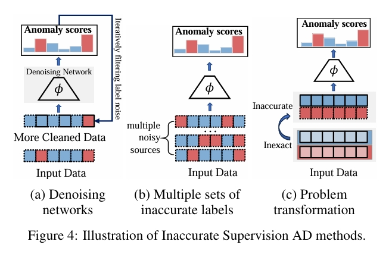

# Weakly-supervised Anomaly Detection: A Survey

This repo is constructed for collecting and categorizing papers about weakly supervised anomaly detection models according to our survey paper——[*Weakly Supervised Anomaly Detection: A Survey*](https://arxiv.org/abs/2302.04549)

## Summary and categorization of weakly supervised anomaly detection (WSAD) algorithms
We first summarize and further categorize existing WSAD algorithms into three categories, including: 
(i) incomplete supervision; (ii) inexact supervision; (iii) inaccurate supervision
### 1.Summary of WSAD Algorithms
| Method | Reference | Venue | Backbone | Modalities | Key Idea | Official Code |
|:--:|:--:|:--:|:--:|:--:|:--:|:--:|
||||Incomplete Supervision||||
| OE  | [ref](https://www.semanticscholar.org/paper/Learning-Outlier-Ensembles%3A-The-Best-of-Both-Worlds-Micenkov%C3%A1-McWilliams/a517bc0a071be0982150c38c8ac3c52093995106) | KDD'14  | -  | Tabular | Anomaly feature representation learning | ×  |
| XGBOD  | [ref](https://ieeexplore.ieee.org/document/8489605)| IJCNN'18 | -  | Tabular | Anomaly feature representation learning | [√](https://github.com/yzhao062/XGBOD) |
| DeepSAD| [ref](https://iclr.cc/virtual_2020/poster_HkgH0TEYwH.html) | ICLR'20 | MLP| Tabular | Anomaly feature representation learning | [√](https://github.com/lukasruff/Deep-SAD-PyTorch) |
| ESAD| [ref](https://arxiv.org/abs/2012.04905) | BMVC'21 | MLP| Tabular | Anomaly feature representation learning | ×  |
| DSSAD  | [ref](https://ieeexplore.ieee.org/document/9414285)| ICASSP'21| CNN| Image/Video| Anomaly feature representation learning | ×  |
| REPEN  | [ref](https://dl.acm.org/doi/10.1145/3219819.3220042)| KDD'18  | MLP| Tabular | Anomaly feature representation learning | ×  |
| AA-BiGAN  | [ref](https://www.ijcai.org/proceedings/2022/0313.pdf)  | IJCAI'22| GAN| Tabular | Anomaly feature representation learning | [√](https://github.com/tbw162/AA-BiGAN)  |
| Dual-MGAN | [ref](https://dl.acm.org/doi/10.1145/3522690)  | TKDD'22 | GAN| Tabular | Anomaly feature representation learning | [√](https://github.com/leibinghe/Dual-MGAN)  |
| SemiGNN| [ref](https://ieeexplore.ieee.org/document/8970829)  | ICDM'19 | MLP+Attention  | Graph| Anomaly feature representation learning | ×  |
| ACT | [ref](https://arxiv.org/abs/2212.01096)| AAAI'23 | GNN| Graph| Anomaly feature representation learning | [√](https://github.com/QZ-WANG/ACT) |
| DevNet | [ref](https://dl.acm.org/doi/10.1145/3292500.3330871)| KDD'19  | MLP| Tabular | Anomaly score learning  | [√](https://github.com/GuansongPang/deviation-network) |
| FEAWAD | [ref](https://ieeexplore.ieee.org/abstract/document/9465358/) | TNNLS'21 | AE | Tabular | Anomaly score learning  | [√](https://github.com/yj-zhou/Feature_Encoding_with_AutoEncoders_for_Weakly-supervised_Anomaly_Detection) |
| LEDGM  | [ref](https://ieeexplore.ieee.org/document/9492295) | TNNLS'21 | AE | Tabular | Anomaly score learning  | ×  |
| PReNet | [ref](https://arxiv.org/abs/1910.13601)  | KDD'23  | MLP| Tabular | Anomaly score learning  | [√](https://github.com/mala-lab/PReNet)  |
| Overlap| [ref](https://dl.acm.org/doi/10.1145/3580305.3599258) | KDD'23  | -  | Tabular | Anomaly score learning  | [√](https://github.com/Minqi824/Overlap) |
| TargAD | [ref](https://ieeexplore.ieee.org/document/10597675) | ICDE'24 | AE | Tabular | Anomaly score learning  | [√](https://github.com/ZhouF-ECNU/TargAD)|
| SAD | [ref](https://arxiv.org/abs/2305.13573) | IJCAI'23| AE | Graph| Anomaly score learning  | [√](https://github.com/D10Andy/SAD)|
| SNARE  | [ref](https://www.cs.cmu.edu/~mmcgloho/pubs/snare.pdf)  | KDD'09  | -  | Graph| Graph learning and label propagation| ×  |
| AESOP  | [ref](https://dl.acm.org/doi/abs/10.1145/2623330.2623342)  | KDD'14  | -  | Graph| Graph learning and label propagation| ×  |
| SemiGAD| [ref](https://ieeexplore.ieee.org/document/9533507)  | IJCNN'21 | GNN| Graph| Graph learning and label propagation| ×  |
| Meta-GDN  | [ref](https://dl.acm.org/doi/10.1145/3442381.3449922)| WWW'21  | GNN| Graph| Graph learning and label propagation| [√](https://github.com/kaize0409/Meta-GDN_AnomalyDetection) |
| SSAD| [ref](https://dl.acm.org/doi/10.5555/2512538.2512545)  | JAIR'13 | -  | Tabular | Active learning| ×  |
| AAD | [ref](https://ieeexplore.ieee.org/document/7837915)  | ICDM'16 | -  | Tabular | Active learning| [√](https://github.com/shubhomoydas/pyaad)  |
| SLA-VAE| [ref](https://dl.acm.org/doi/abs/10.1145/3485447.3511984)  | WWW'22  | VAE| Time series| Active learning| ×  |
| SOEL| [ref](https://arxiv.org/abs/2302.07832) | ICML'23 | CNN| Tabular/Image | Active learning  | [√](https://github.com/aodongli/Active-SOEL) |
| Meta-AAD  | [ref](https://ieeexplore.ieee.org/document/9338270)  | ICDM'20 | MLP| Tabular | Reinforcement learning  | [√](https://github.com/daochenzha/Meta-AAD) |
| DPLAN  | [ref](https://dl.acm.org/doi/10.1145/3447548.3467417)| KDD'21  | MLP| Tabular | Reinforcement learning  | ×  |
| CutAddPaste  | [ref](https://dl.acm.org/doi/10.1145/3637528.3671739) | KDD'24  | CNN| Time-series| Data Augmentation | [√](https://github.com/ruiking04/CutAddPaste) |
| NNG-Mix| [ref](https://arxiv.org/abs/2311.11961)  | TNNLS'24 | -  | Tabular | Data Augmentation | [√](https://github.com/donghao51/NNG-Mix)|
| RoSAS  | [ref](https://www.sciencedirect.com/science/article/abs/pii/S0306457323001966)| IP&M'23  | MLP| Tabular | Data Augmentation | [√](https://github.com/xuhongzuo/rosas)  |
| ADGym  | [ref](https://arxiv.org/abs/2309.15376) | NIPS'23 | -  | Tabular | AutoML | [√](https://github.com/Minqi824/ADGym)|
| ConsisGAD | [ref](https://openreview.net/forum?id=elMKXvhhQ9) | ICLR'24 | GNN| Graph| Data Augmentation | [√](https://github.com/Xtra-Computing/ConsisGAD) |
| GenGA  | [ref](https://dl.acm.org/doi/10.1145/3637528.3671929)  | KDD'24  | GCN| Graph| Data Augmentation | ×  |
||||Inexact Supervision||||
| Sultani et al. | [ref](https://ieeexplore.ieee.org/document/8578776)| CVPR'18 | MLP| Video| Multiple Instance Learning | [√](https://github.com/vantage-vision-vv/Anomaly-Detection-in-Surveillance-Videos) |
| TCN-IBL| [ref](https://ieeexplore.ieee.org/document/8803657)| ICIP'19 | CNN| Video| Multiple Instance Learning | ×  |
| AR-Net | [ref](https://ieeexplore.ieee.org/document/9102722)| ICME'20 | MLP| Video| Multiple Instance Learning | [√](https://github.com/wanboyang/Anomaly_AR_Net_ICME_2020) |
| RTFM| [ref](https://ieeexplore.ieee.org/document/9710957)| ICCV'21 | CNN+Attention  | Video| Multiple Instance Learning | [√](https://github.com/tianyu0207/RTFM)|
| Zhu et al. | [ref](https://arxiv.org/abs/1907.10211)| BMVC'19 | AE+Attention| Video| Multiple Instance Learning | ×  |
| Purwanto et al.| [ref](https://ieeexplore.ieee.org/document/9710685)| ICCV'21 | TRN+Attention  | Video| Multiple Instance Learning | ×  |
| MPRF| [ref](https://www.ijcai.org/proceedings/2021/0162.pdf)  | IJCAI'21 | MLP+Attention  | Video| Multiple Instance Learning | ×  |
| MCR | [ref](https://ieeexplore.ieee.org/abstract/document/9860012)| ICME'22 | MLP+Attention  | Video| Multiple Instance Learning | ×  |
| XEL | [ref](https://ieeexplore.ieee.org/document/9560033)| SPL'21  | MLP| Video| Cross-epoch Learning  | [√](https://github.com/sdjsngs/XEL-WSAD)  |
| MIST| [ref](https://ieeexplore.ieee.org/document/9578773)| CVPR'21 | MLP+Attention  | Video| Multiple Instance Learning | [√](https://github.com/fjchange/MIST_VAD) |
| MSLNet | [ref](https://ojs.aaai.org/index.php/AAAI/article/download/20028/version/18325/19787) | AAAI'22 | Transformer  | Video| Multiple Instance Learning | [√](https://github.com/xidianai/MSL)|
| SRF | [ref](https://ieeexplore.ieee.org/document/9204830)| SPL'20  | MLP| Video| Self Reasoning  | ×  |
| VadCLIP| [ref](https://arxiv.org/abs/2308.11681)  | AAAI'24 | Attention| Video| Pre-trained Foundation Model  | [√](https://github.com/nwpu-zxr/VadCLIP)  |
| MGFN| [ref](https://arxiv.org/abs/2211.15098) | AAAI'23 | CNN+Attention  | Video| Multiple Instance Learning | [√](https://github.com/carolchenyx/MGFN.) |
| TPWNG  | [ref](https://arxiv.org/abs/2404.08531)  | CVPR'24 | Attention| Video| Pre-trained Foundation Model  | -  |
| CoMo| [ref](https://openaccess.thecvf.com/content/CVPR2023/papers/Cho_Look_Around_for_Anomalies_Weakly-Supervised_Anomaly_Detection_via_Context-Motion_Relational_CVPR_2023_paper.pdf)  | CVPR'23 | GCN+CNN  | Video| Multiple Instance Learning | -  |
| UMIL| [ref](https://arxiv.org/abs/2303.12369) | CVPR'23 | MLP| Video| Multiple Instance Learning | [√](https://github.com/ktr-hubrt/UMIL) |
| UR-DMU | [ref](https://arxiv.org/abs/2302.05160)  | AAAI'23 | Attention| Video| Multiple Instance Learning | [√](https://github.com/henrryzh1/UR-DMU)  |
| PUMA| [ref](https://dl.acm.org/doi/10.1145/3580305.3599409)| KDD'23  | AE | Time-series| Multiple Instance Learning | [√](https://github.com/Lorenzo-Perini/PU-MIL-AD) |
| CU-Net | [ref](https://arxiv.org/abs/2212.04090) | CVPR'23 | MLP| Video| Self-training  | [√](https://github.com/ArielZc/CU-Net) |
| CLAWS Net+| [ref](https://ieeexplore.ieee.org/document/10136845)  | TNNLS'23| MLP| Video| Clustering  | [√](https://github.com/xaggi/claws_eccv) |
| WETAS  | [ref](https://ieeexplore.ieee.org/document/9710920)  | ICCV'21 | MLP| Time-series/Video | Dynamic Time Warping | ×  |
| Iwata et al. | [ref](https://dl.acm.org/doi/10.1007/s10994-020-05880-w)| ML Journal'20 | AE| Tabular | AUC maximization  | ×  |
| Isudra | [ref](https://dl.acm.org/doi/10.1145/3439870) | TIST'21 | -  | Time-series| Bayesian optimization| [√](https://github.com/jb3dahmen/indirectsupervision) |
||||Inaccurate Supervision||||
| LAC| [ref](https://dl.acm.org/doi/10.1145/3459637.3482433)  | CIKM'21 | MLP/GBDT | Tabular| Ensemble learning  | × |
| ADMoE | [ref](https://arxiv.org/abs/2208.11290) | AAAI'23 | Agnostic | Tabular| Ensemble learning  | [√](https://github.com/microsoft/admoe)  |
| BGPAD | [ref](https://ieeexplore.ieee.org/document/9651957)  | ICNP'21 | LSTM+Attention | Time series  | Denoising network  | [√](https://github.com/universetao/A-General-Framework-BGP-Anomaly-Detection) |
| SemiADC  | [ref](https://www.sciencedirect.com/science/article/pii/S0020025521003856) | IS Journal'21 | GAN| Graph  | Denoising network  | × |
| NRGL  | [ref](https://www.ijcai.org/proceedings/2024/271)| IJCAI'24 | MLP| Graph  | Denoising network  | [√](https://github.com/Shzuwu/NRGL)|
| Zhong et al.| [ref](https://arxiv.org/abs/1903.07256) | CVPR'19 | GCN| Video  | Problem Transformation | [√](https://github.com/jx-zhong-for-academic-purpose/GCN-Anomaly-Detection) |

### 2.Categorization of WSAD algorithms
#### 2.1 AD with Incomplete Supervision

- **_Anomaly Feature Representation Learning_**
  - **OE**\
  📄[Learning outlier ensembles:The best of both worlds–supervised and unsupervised](https://www.semanticscholar.org/paper/Learning-Outlier-Ensembles%3A-The-Best-of-Both-Worlds-Micenkov%C3%A1-McWilliams/a517bc0a071be0982150c38c8ac3c52093995106)
  - **XGBOD**\
  📄[Xgbod: improving supervised outlier detection with unsupervised representation learning](https://ieeexplore.ieee.org/document/8489605)\
  👉[Code Link](https://github.com/yzhao062/XGBOD)
  - **DeepSAD**\
  📄[Deep semi-supervised anomaly detection](https://iclr.cc/virtual_2020/poster_HkgH0TEYwH.html)\
  👉[Code Link](https://github.com/lukasruff/Deep-SAD-PyTorch)
  - **ESAD**\
  📄[Esad: End-to-end deep semi-supervised anomaly detection](https://arxiv.org/abs/2012.04905v1)
  - **REPEN**\
  📄[Learning representations of ultrahigh-dimensional data for random distance-based outlier detection](https://dl.acm.org/doi/10.1145/3219819.3220042)
  - **DSSAD**\
  📄[Learning discriminative features for semi-supervised anomaly detection](https://ieeexplore.ieee.org/document/9414285)
  - **AA-BiGAN**\
  📄[Anomaly detection by leveraging incomplete anomalous knowledge with anomaly-aware bidirectional gans](https://www.ijcai.org/proceedings/2022/0313.pdf)\
  👉[Code Link](https://github.com/tbw162/AA-BiGAN)
  - **Dual-MGAN**\
  📄[Dual-mgan: An efficient approach for semi-supervised outlier detection with few identified anomalies](https://dl.acm.org/doi/10.1145/3522690)\
  👉[Code Link](https://github.com/leibinghe/Dual-MGAN)
  - **SemiGNN**\
  📄[A Semi-Supervised Graph Attentive Network for Financial Fraud Detection](https://ieeexplore.ieee.org/document/8970829)\
  - **ACT**\
  📄[Cross-Domain Graph Anomaly Detection via Anomaly-aware Contrastive Alignment](https://arxiv.org/abs/2212.01096/)\
  👉[Code Link](https://github.com/QZ-WANG/ACT)
- **_Anomaly Score Learning_**
  - **DevNet**\
  📄[Deep anomaly detection with deviation networks](https://dl.acm.org/doi/10.1145/3292500.3330871)\
  👉[Code Link](https://github.com/GuansongPang/deviation-network)
  - **PReNet**\
  📄[Deep weakly-supervised anomaly detection](https://arxiv.org/abs/1910.13601)
  👉[Code Link](https://github.com/mala-lab/PReNet)
  - **FEAWAD**\
  📄[Feature encoding with autoencoders for weakly supervised anomaly detection](https://ieeexplore.ieee.org/abstract/document/9465358/)\
  👉[Code Link](https://github.com/yj-zhou/Feature_Encoding_with_AutoEncoders_for_Weakly-supervised_Anomaly_Detection)
  - **LEDGM**\
  📄[Semisupervised Training of Deep Generative Models for High-Dimensional Anomaly Detection](https://ieeexplore.ieee.org/document/9492295/)\
  - **Overlap**\
  📄[Anomaly Detection with Score Distribution Discrimination](https://dl.acm.org/doi/10.1145/3580305.3599258)\
  👉[Code Link](https://github.com/Minqi824/Overlap)
  - **TargAD**\
  📄[A Robust Prioritized Anomaly Detection when Not All Anomalies are of Primary Interest](https://ieeexplore.ieee.org/document/10597675)\
  👉[Code Link](https://github.com/ZhouF-ECNU/TargAD)
  - **SAD**\
  📄[SAD: Semi-Supervised Anomaly Detection on Dynamic Graphs](https://arxiv.org/abs/2305.13573)\
  👉[Code Link](https://github.com/D10Andy/SAD)
- **_Graph Learning_**
  - **SNARE**\
  📄[Snare: a link analytic system for graph labeling and risk detection](https://www.cs.cmu.edu/~mmcgloho/pubs/snare.pdf)
  - **AESOP**\
  📄[Guilt by association: large scale malware detection by mining file-relation graphs](https://dl.acm.org/doi/abs/10.1145/2623330.2623342)
  - **SemiGNN**\
  📄[A semi-supervised graph attentive network for financial fraud detection](https://ieeexplore.ieee.org/document/8970829)
  - **SemiGAD**\
  📄[Semi-supervised anomaly detection on attributed graphs](https://ieeexplore.ieee.org/document/9533507)
  - **Meta-GDN**\
  📄[Few-shot network anomaly detection via cross-network meta-learning](https://dl.acm.org/doi/10.1145/3442381.3449922)\
  👉[Code Link](https://github.com/kaize0409/Meta-GDN_AnomalyDetection)
  - **SemiADC**\
  📄[Semi-supervised anomaly detection in dynamic communication networks](www.sciencedirect.com/science/article/pii/S0020025521003856)

  - **GraphUCB**\
  📄[Interactive anomaly detection on attributed networks](https://dl.acm.org/doi/10.1145/3289600.3290964)\
  👉[Code Link](https://github.com/kaize0409/GraphUCB_AnomalyDetection)
  
- **_Active learning and reinforcement learning_**
  - **SSAD**\
  📄[Toward supervised anomaly detection](https://dl.acm.org/doi/10.5555/2512538.2512545)
  - **AAD**\
  📄[Incorporating expert feedback into active anomaly discover](https://ieeexplore.ieee.org/document/7837915)\
  👉[Code Link](https://github.com/shubhomoydas/pyaad)
  - **Meta-AAD**\
  📄[Meta-aad: Active anomaly detection with deep reinforcement learning](https://ieeexplore.ieee.org/document/9338270)\
  👉[Code Link](https://github.com/daochenzha/Meta-AAD)
  - **DPLAN**\
  📄[Toward deep supervised anomaly detection: Reinforcement learning from partially labeled anomaly data](https://dl.acm.org/doi/10.1145/3447548.3467417)
  - **SLA-VAE**\
  📄[A semi-supervised vae based active anomaly detection framework in multivariate time series for online systems](https://dl.acm.org/doi/abs/10.1145/3485447.3511984)
  - **SOEL**\
  📄[Deep Anomaly Detection under Labeling Budget Constraints](https://arxiv.org/abs/2302.07832)\
  👉[Code Link](https://github.com/aodongli/Active-SOEL)

- **_Data Augmentation_**
  - **CutAddPaste**\
  📄[CutAddPaste: Time Series Anomaly Detection by Exploiting Abnormal Knowledge](https://dl.acm.org/doi/10.1145/3637528.3671739)
  👉[Code Link](https://github.com/ruiking04/CutAddPaste)
  - **NNG-Mix**\
  📄[NNG-Mix: Improving Semi-supervised Anomaly Detection with Pseudo-anomaly Generation](https://arxiv.org/abs/2311.11961)\
  👉[Code Link](https://github.com/donghao51/NNG-Mix)
  - **ROSAS**\
  📄[RoSAS: Deep Semi-supervised Anomaly Detection with Contamination-resilient Continuous Supervision](https://www.sciencedirect.com/science/article/abs/pii/S0306457323001966)\
  👉[Code Link](https://github.com/xuhongzuo/rosas)
  - **ADGym**\
  📄[ADGym: Design Choices for Deep Anomaly Detection](https://arxiv.org/abs/2309.15376)\
  👉[Code Link](https://github.com/Minqi824/ADGym)
  - **ConsisGAD**\
  📄[Consistency Training with Learnable Data Augmentation for Graph Anomaly Detection with Limited Supervision](https://openreview.net/forum?id=elMKXvhhQ9)\
  👉[Code Link](https://github.com/Xtra-Computing/ConsisGAD)
  - **GenGA**\
  📄[Graph Anomaly Detection with Few Labels: A Data-Centric Approach](https://dl.acm.org/doi/10.1145/3637528.3671929)\

#### 2.2 AD with Inexact Supervision

- **_MIL-based_**
  - **Sultani et al.**\
  📄[Real-world anomaly detection in surveillance videos](https://ieeexplore.ieee.org/document/8578776)\
  👉[Code Link](https://github.com/vantage-vision-vv/Anomaly-Detection-in-Surveillance-Videos)
  - **AR-Net**\
  📄[Weakly supervised video anomaly detection via center-guided discriminative learning](https://ieeexplore.ieee.org/document/9102722)\
  👉[Code Link](https://github.com/wanboyang/Anomaly_AR_Net_ICME_2020)
  - **TCN-IBL**\
  📄[Temporal convolutional network with complementary inner bag loss for weakly supervised anomaly detection](https://ieeexplore.ieee.org/document/8803657)
  - **RTFM**\
  📄[Weakly-supervised video anomaly detection with robust temporal feature magnitude learning](https://ieeexplore.ieee.org/document/9710957)\
  👉[Code Link](https://github.com/tianyu0207/RTFM)
  - **Zhu et al.**\
  📄[Motion-aware feature for improved video anomaly detection](https://arxiv.org/abs/1907.10211)
  - **Purwanto et al.**\
  📄[Dance with self-attention: A new look of conditional random fields on anomaly detection in videos](https://ieeexplore.ieee.org/document/9710685)
  - **MPRF**\
  📄[Weakly-supervised spatio-temporal anomaly detection in surveillance video](https://www.ijcai.org/proceedings/2021/0162.pdf)
  - **MCR**\
  📄[Multi-scale continuity-aware refinement network for weakly supervised video anomaly detection](https://ieeexplore.ieee.org/abstract/document/9860012)
  - **XEL**\
  📄[Cross-epoch learning for weakly supervised anomaly detection in surveillance videos](https://ieeexplore.ieee.org/document/9560033)\
  👉[Code Link](https://github.com/sdjsngs/XEL-WSAD)
  - **MIST**\
  📄[MIST: Multiple instance self-training framework for video anomaly detection](https://ieeexplore.ieee.org/document/9578773)\
  👉[Code Link](https://github.com/fjchange/MIST_VAD)
  - **MSLNet**\
  📄[Self-training multi-sequence learning with transformer for weakly supervised video anomaly detection](https://ojs.aaai.org/index.php/AAAI/article/download/20028/version/18325/19787)\
  👉[Code Link](https://github.com/xidianai/MSL)
  - **VadCLIP**\
  📄[VadCLIP: Adapting Vision-Language Models for Weakly Supervised Video Anomaly Detection](https://arxiv.org/abs/2308.11681)\
  👉[Code Link](https://github.com/nwpu-zxr/VadCLIP)
  - **MGFN**\
  📄[MGFN: Magnitude-Contrastive Glance-and-Focus Network for Weakly-Supervised Video Anomaly Detection](https://arxiv.org/abs/2211.15098)\
  👉[Code Link](https://github.com/carolchenyx/MGFN.)
  - **TPWNG**\
  📄[Text Prompt with Normality Guidance for Weakly Supervised Video Anomaly Detection](https://arxiv.org/abs/2404.08531)\
  - **CoMo**\
  📄[Look Around for Anomalies: Weakly-supervised Anomaly Detection via Context-Motion Relational Learning](https://openaccess.thecvf.com/content/CVPR2023/papers/Cho_Look_Around_for_Anomalies_Weakly-Supervised_Anomaly_Detection_via_Context-Motion_Relational_CVPR_2023_paper.pdf)\
  - **UMIL**\
  📄[Unbiased Multiple Instance Learning for Weakly Supervised Video Anomaly Detection](https://arxiv.org/abs/2303.12369)\
  👉[Code Link](https://github.com/ktr-hubrt/UMIL)
  - **UR-DMU**\
  📄[Dual Memory Units with Uncertainty Regulation for Weakly Supervised Video Anomaly Detection](https://arxiv.org/abs/2302.05160)\
  👉[Code Link](https://github.com/henrryzh1/UR-DMU)
  - **PUMA**\
  📄[Learning from Positive and Unlabeled Multi-Instance Bags in Anomaly Detection](https://dl.acm.org/doi/10.1145/3580305.3599409)\
  👉[Code Link](https://github.com/Lorenzo-Perini/PU-MIL-AD)
  - **CU-Net**\
  📄[Exploiting Completeness and Uncertainty of Pseudo Labels for Weakly Supervised Video Anomaly Detection](https://arxiv.org/abs/2212.04090)\
  👉[Code Link](https://github.com/ArielZc/CU-Net)
- **_Non MIL-based_**
  - **SRF**\
  📄[A self-reasoning framework for anomaly detection using video-level labels](https://ieeexplore.ieee.org/document/9204830)
  - **WETAS**\
  📄[Weakly supervised temporal anomaly seg- mentation with dynamic time warping](https://ieeexplore.ieee.org/document/9710920)
  - **CLAWS Net+**\
  📄[Clustering Aided Weakly Supervised Training to Detect Anomalous Events in Surveillance Videos](https://ieeexplore.ieee.org/document/10136845)\
  👉[Code Link](https://github.com/xaggi/claws_eccv)
  - **Inexact AUC**\
  📄[Anomaly detection with inexact labels](https://dl.acm.org/doi/10.1007/s10994-020-05880-w)
  - **Isudra**\
  📄[Indirectly supervised anomaly detection of clinically meaningful health events from smart home data](https://dl.acm.org/doi/10.1145/3439870)\
  👉[Code Link](https://github.com/jb3dahmen/indirectsupervision)

#### 2.3 AD with Inaccurate Supervision

- **_Ensemble Learning_**
  - **LAC**\
  📄[Fraud Detection under Multi-Sourced Extremely Noisy Annotations](https://dl.acm.org/doi/10.1145/3459637.3482433)
  - **ADMoE**\
  📄[ADMoE: Anomaly detection with mixture-of-experts from noisy labels](https://arxiv.org/abs/2208.11290)\
  👉[Code Link](https://github.com/microsoft/admoe)
- **_Denosing Network_**
  - **BGPAD**\
  📄[Isp self-operated bgp anomaly detection based on weakly supervised learning](https://ieeexplore.ieee.org/document/9651957)\
  👉[Code Link](https://github.com/universetao/A-General-Framework-BGP-Anomaly-Detection)
  - **SemiADC**\
  📄[Semi-supervised anomaly detection in dynamic communication networks](https://www.sciencedirect.com/science/article/pii/S0020025521003856)
  - **NRGL**\
  📄[Robust Heterophilic Graph Learning against Label Noise for Anomaly Detection](https://www.ijcai.org/proceedings/2024/271)\
  👉[Code Link](https://github.com/Shzuwu/NRGL)

- **_Problem Transformation_**
  - **Zhong et al.**\
  📄[Graph Convolutional Label Noise Cleaner: Train a Plug-And-Play Action Classifier for Anomaly Detection](https://ieeexplore.ieee.org/document/8953791)\
  👉[Code Link](https://github.com/jx-zhong-for-academic-purpose/GCN-Anomaly-Detection)

## Experiment
The experimental results can be seen in our previous work [ADBench](https://github.com/Minqi824/ADBench)

